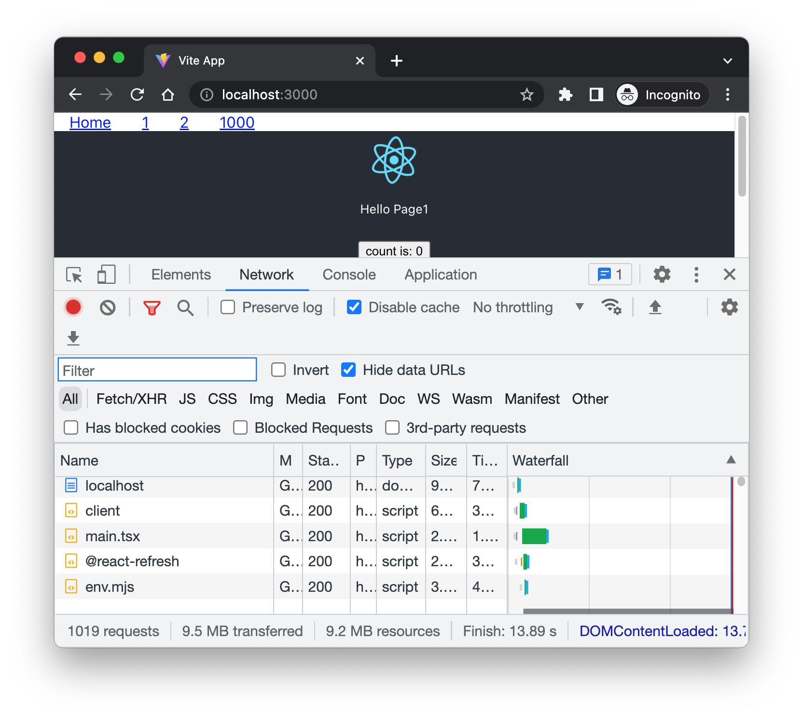
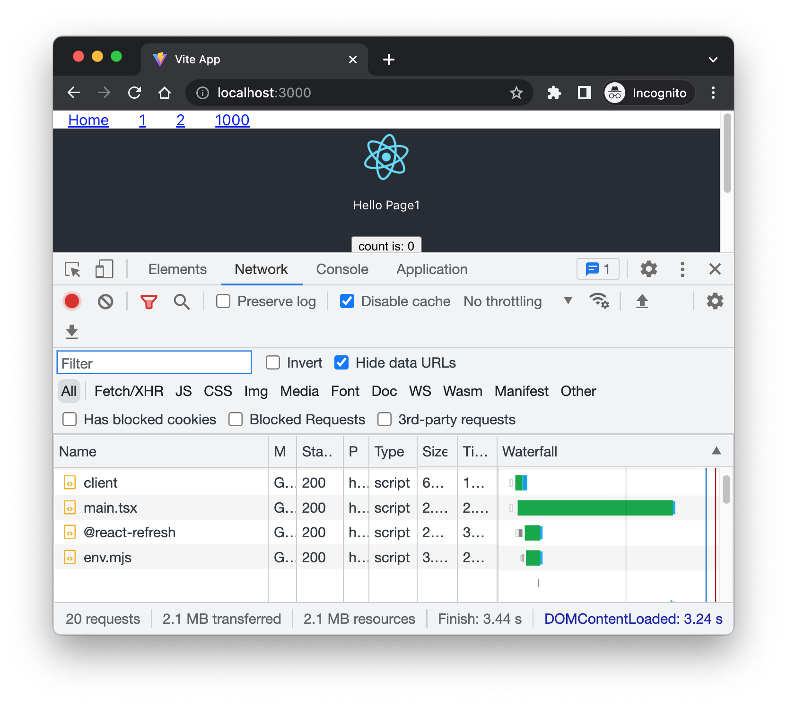
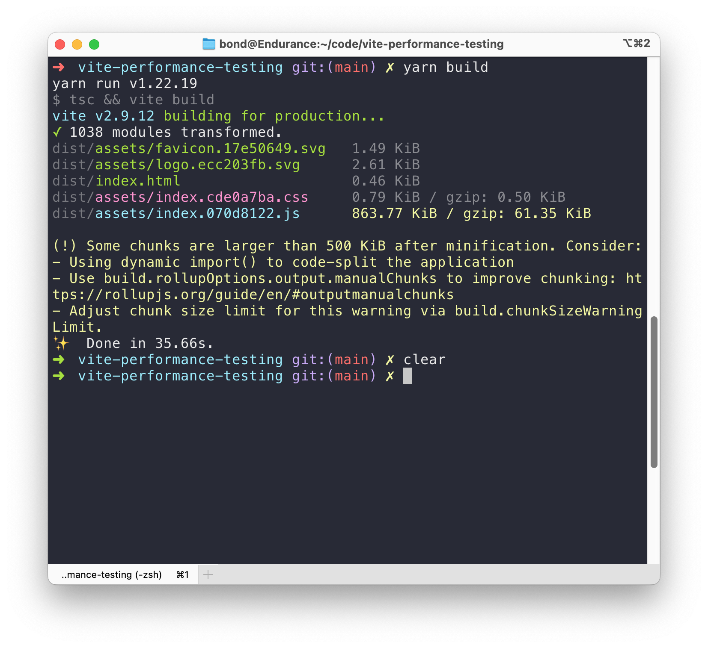
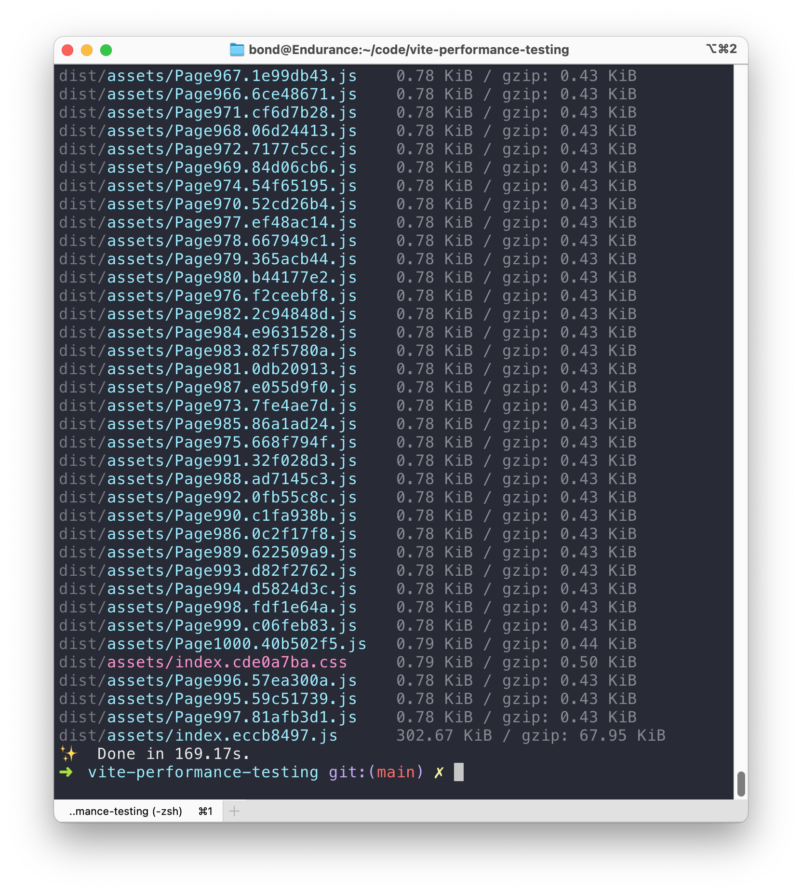
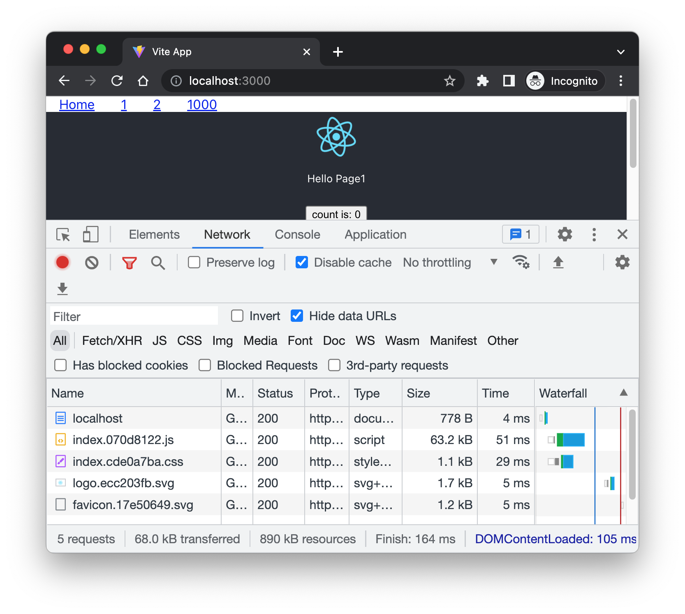
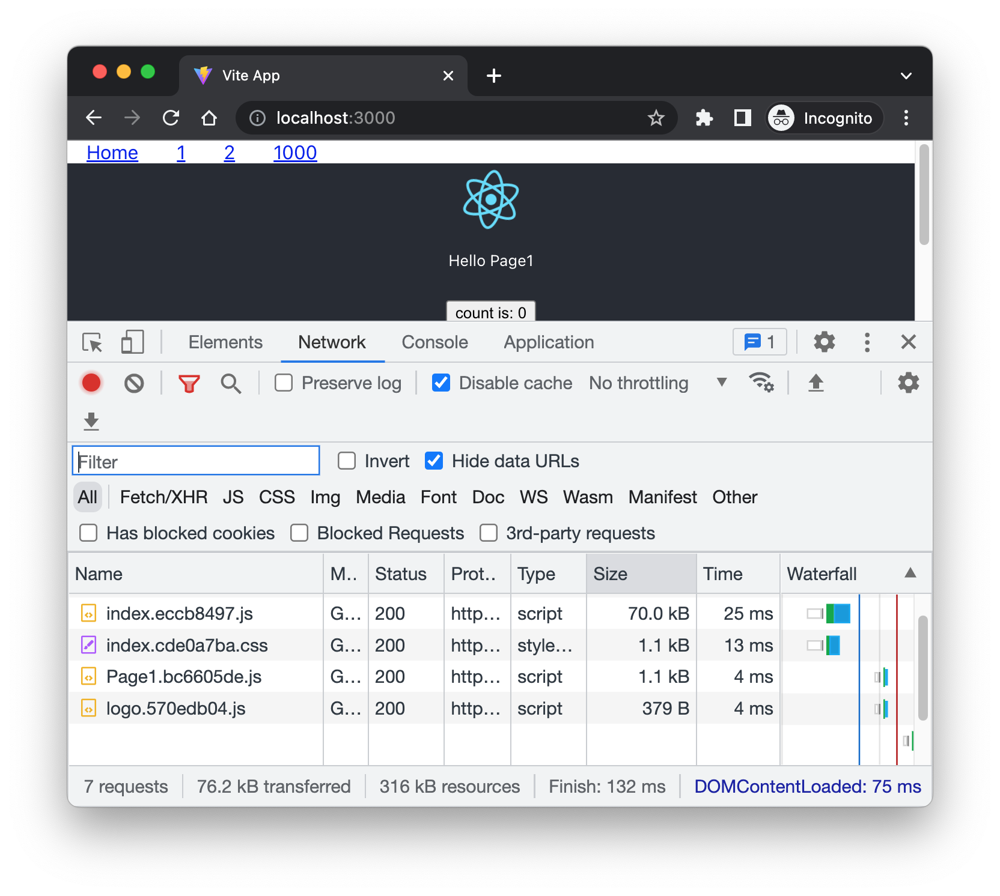

# Testing Vite + React route-based code splitting demo

This app is initialized with [Vite](https://vitejs.dev/):

```sh
 pnpm create vite vite-react-code-splitting-demo --template react-ts
```

## Time costs

|   | without route-based code splitting   | with route-based code splitting  |
|---|---|---|
| dev page load time(s)  | 14  | 3  |
| HMR time(s)  | <1  | <1  |
| yarn build time(s) | 35  | 170  |
| serve dist page load time(s)  | 164  | 132  |
| serve dist initial transfer(KB)  | 68  | 76  |
| serve dist initial transfer(KB)  | 890  | 316  |

* There is more initial transfer data with code splitting than without code splitting. 🤣 Maybe because our page component contains too little code.

## Testing device

> MacBook Pro 15, mid 2015(Intel 4770HQ + 16G + 256G)

## Screenshots

Dev page load without code splitting.


Dev page load without code splitting.


Yarn build without code splitting.


Yarn build with code splitting.


Serve without code splitting.
All js files are bundled in one js file.


Serve with code splitting.
Every page is in a standalone js file.
Navigate to a new page to load and display the page js file.


## TODO

- On my Mac, I am generating 1000 page components with this code in [gen_pages.sh](gen_pages.sh) file. How can I generate 1000 page component quicker? Please fire an issue or send a PR. Thanks in advance.❤️

    ```sh
    cp SamplePage.tsx temp
    gsed -i "s/PageName/Page$i/" temp
    cp temp "src/pages/Page$i.tsx"
    ```
